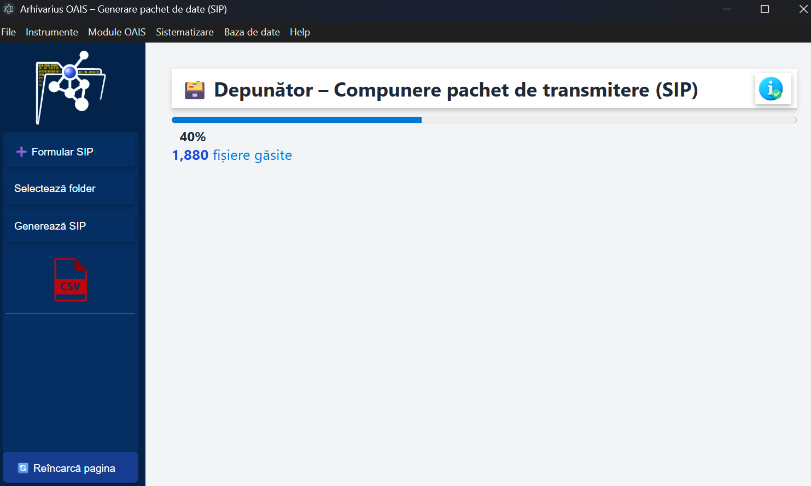
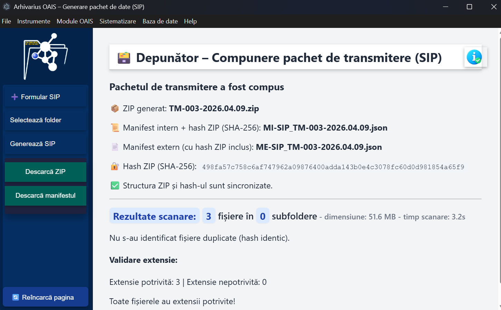

# Arhivarius SIP – Prezentare

Arhivarius SIP este un modul dedicat compunerii pachetului de transmitere (SIP), conform cerințelor OAIS.  
Aplicația permite validarea fișierelor, generarea manifestelor și crearea pachetului ZIP final pentru transfer.

---

## Funcționare (pe scurt)

### 1. Formular SIP
Completezi câmpurile obligatorii: județ, volum, creator de arhivă, fond.  
Opțional poți adăuga observații.

### 2. Selectează folder
Alegi folderul cu fișierele pentru SIP.  
Aplicația scanează și identifică automat:
- fișiere virusate (se șterg automat în ~60s);
- fișiere dublete (poți alege: ștergere, mutare la coș, mutare în alt folder, creare fișier martor);
- fișiere cu extensie modificată (poți corecta extensia instant).

### 3. Generează SIP
Aplicația execută automat 6 pași sincronizați:
- validare formular;
- calcul hash SHA‑256 pentru fiecare fișier;
- creare ZIP + manifest intern;
- calcul hash SHA‑256 pentru ZIP;
- creare manifest extern (include hash ZIP);
- afișarea informațiilor despre ZIP, manifeste și sincronizare.

### 4. Raport de transfer
Poți descărca fișierul CSV cu detalii despre conținutul SIP.

---

## Capturi de ecran

### Formular SIP

### Scanare și progres

### Rezultate scanare

### Pachet generat

---

## Tehnologii implicate (în fundal)
Aplicația utilizează instrumente specializate pentru analiză și validare:
- **ExifTool** – extragere metadate;
- **Siegfried + baza PRONOM** – identificare tipuri de fișiere;
- **veraPDF** – validare PDF/A;
- alte utilitare interne pentru hashing, structurare și verificări.

---

## Status
Aceasta este o versiune minimalistă a documentației.  
Va fi extinsă treptat cu detalii tehnice, diagrame și exemple de utilizare.
